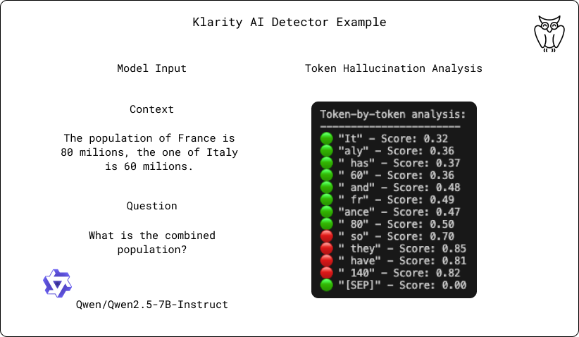
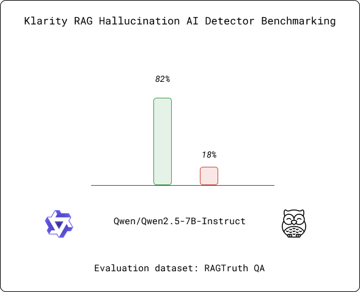
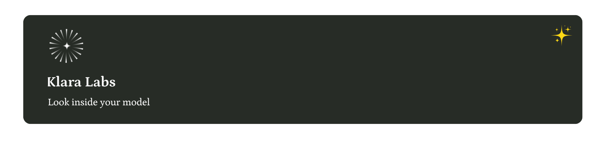

<div align="center">

  

  # RAG-Klarity

  **State-of-the-Art Hallucination Detection for RAG Systems**
  <br>
  <br>
  🔍 **Instantly identify hallucinations in AI-generated content**
  <br>
  <br>
  📊 **80.3% F1 Score on RAGTruth benchmark**
  <br>
  <br>
  ⚡ **30 examples/second on a single GPU**
  <br>
  <br>
  <a href="https://discord.gg/wCnTRzBE">
    
  </a>
</div>

## 🎯 Overview

RAG-Klarity is a specialized lightweight model designed to detect hallucinations in Retrieval-Augmented Generation (RAG) systems. It analyzes whether AI-generated responses are actually grounded in the provided reference materials, even when those responses appear correct at first glance.

- **Real-time Detection**: Analyze responses as they're generated
- **Token-level Granularity**: Pinpoint exactly where hallucinations occur
- **Confidence Scoring**: Quantify the degree of hallucination risk
- **Contextual Awareness**: Evaluate responses specifically against the provided reference material

<div align="center">
  <br>
  <p><i>Example of token-level analysis showing hallucinated portions of a response</i></p>
  
  <br>
</div>

## 📊 Benchmark Results

Our hallucination detection model achieves state-of-the-art performance while maintaining exceptional inference speed:

- **80.3% F1 Score** on the RAGTruth benchmark, outperforming previous encoder-based models
- **30 examples/second** processing speed on a single GPU
- **Compact model size** (300M parameters)
- **30x smaller** than comparable LLM-based detection systems
- **Long context support** up to 4,096 tokens

<div align="center">
  <br>
  <p><i>Hallucination Detection Benchmark Results</i></p>
  
  <br>
</div>

## 🚀 Quick Start Guide

Get an API key from [Klara Labs Platform](https://platform.klaralabs.com/dashboard)

### Basic Usage

```python
import requests

# Endpoint and key
api_key = "YOUR_API_KEY"
url = "https://api.klaralabs.com/detect"
headers = {"X-API-Key": api_key, "Content-Type": "application/json"}

# Example data
data = {
    "context": ["Italy is a country in Europe. The capital of Italy is Rome."],
    "question": "What is the capital of Italy?",
    "answer": "Paris is the capital of France"
}

# Send request to detect hallucinations
response = requests.post(url, headers=headers, json=data)

# Process the response
if response.status_code == 200:
    result = response.json()
    print(f"Hallucination detected: {result['is_hallucinated']}")
    print(f"Hallucination score: {result['hallucination_score']:.2f}")
    print(f"Hallucinated text: {result['hallucinated_text']}")
else:
    print(f"Error: {response.status_code}")
    print(response.text)
```

### Token-Level Analysis

Gain deeper insights with token-level analysis:

```python
import requests
import json

# Set your API key
api_key = "YOUR_API_KEY"
url = "https://api.klaralabs.com/detect"
headers = {
    "X-API-Key": api_key,
    "Content-Type": "application/json"
}

# Example data with potential hallucination
data = {
    "context": ["The Earth is the third planet from the Sun."],
    "question": "What is Earth's position in the solar system?",
    "answer": "Earth is the third planet from the Sun and has one natural satellite."
}

# Send request
response = requests.post(url, headers=headers, json=data)
result = response.json()

# Extract and analyze token-level results
print(f"Overall hallucination score: {result['hallucination_score']:.2f}")
print("\nToken-by-token analysis:")
print("-----------------------")

# Print each token with its prediction and probability
for token in result["tokens"]:
    # Create a simple visual indicator of hallucination likelihood
    indicator = "🔴" if token["pred"] == 1 else "🟢"
    
    # Print token with its hallucination probability
    print(f"{indicator} \"{token['token']}\" - Score: {token['prob']:.2f}")

# Optional: Save detailed results to file for further analysis
with open("token_analysis.json", "w") as f:
    json.dump(result["tokens"], f, indent=2)
    print("\nDetailed token analysis saved to token_analysis.json")
```

### Monitoring API Usage

Track your API usage and remaining credits:

```python
import requests

# Set your API key here
api_key = "YOUR_API_KEY"
api_url = "https://api.klaralabs.com/usage"
headers = {"X-API-Key": api_key, "Content-Type": "application/json"}

def check_usage():
    try:
        # Get usage information
        response = requests.get(f"{api_url}", headers=headers)
        
        if response.status_code == 200:
            usage = response.json()
            print("\n===== Klara Labs API Usage =====")
            print(f"🔑 API Key: Valid")
            print(f"📊 Total requests: {usage['total_requests']}")
            
            # Check if credits information is available
            if usage.get('credits_remaining') is not None:
                print(f"💰 Credits remaining: {usage['credits_remaining']}")
                # Calculate usage percentage if total credits are available
                if usage.get('total_credits') is not None:
                    used = usage['total_credits'] - usage['credits_remaining']
                    percentage = (used / usage['total_credits']) * 100
                    print(f"📈 Usage: {percentage:.1f}% ({used} of {usage['total_credits']})")
            
            # Print any plan information if available
            if usage.get('plan') is not None:
                print(f"📝 Current plan: {usage['plan']}")
                
            print("===============================")
            return True
        else:
            print(f"\n🔴 Error checking usage: {response.status_code}")
            print(response.text)
            return False
            
    except Exception as e:
        print(f"\n🔴 Error: {str(e)}")
        return False

if __name__ == "__main__":
    check_usage()
```

## 💡 Why It Matters

- **Increased Reliability**: Ensure your RAG systems produce trustworthy, context-grounded responses
- **Improved Transparency**: Understand exactly which parts of a response may create problems
- **Enhanced Trust**: Provide confidence metrics that help users appropriately calibrate their trust in AI outputs

## 🔍 Use Cases

RAG-Klarity is ideal for:

- **Enterprise RAG Systems**: Ensure AI-generated knowledge base responses are factually grounded
- **Content Moderation**: Detect potentially misleading AI-generated content in real-time
- **Academic Research**: Validate information retrieval and generation systems
- **Customer Support**: Ensure AI assistants provide accurate, contextually relevant answers
- **Medical & Legal Applications**: Verify AI responses in high-stakes domains

## 🛠️ Integration Options

Our RAG Hallucination Detector API integrates seamlessly with existing RAG pipelines, allowing for:
- Pre-deployment validation
- Runtime monitoring
- Feedback mechanisms for model improvement

## 📊 API Response Format

The API returns structured data including:

```json
{
  "is_hallucinated": true,
  "hallucination_score": 0.92,
  "hallucinated_text": "Paris is the capital of France",
  "tokens": [
    {
      "token": "Paris",
      "pred": 1,
      "prob": 0.98
    },
    {
      "token": " is",
      "pred": 1,
      "prob": 0.97
    },
    {
      "token": " the",
      "pred": 1,
      "prob": 0.92
    },
    {
      "token": " capital",
      "pred": 1,
      "prob": 0.95
    },
    {
      "token": " of",
      "pred": 1,
      "prob": 0.91
    },
    {
      "token": " France",
      "pred": 1,
      "prob": 0.99
    }
  ]
}
```

## 📫 Community & Support

- [Website](https://klaralabs.com)
- [Discord Community](https://discord.gg/wCnTRzBE) for discussions & support
- [GitHub Issues](https://github.com/klara-research/rag-klarity/issues) for bugs and features
- Email: support@klaralabs.com

## 📝 License

This is a closed-source project with a proprietary license. API access is provided through [Klara Labs Platform](https://platform.klaralabs.com/dashboard).

<div align="center">

  

</div>